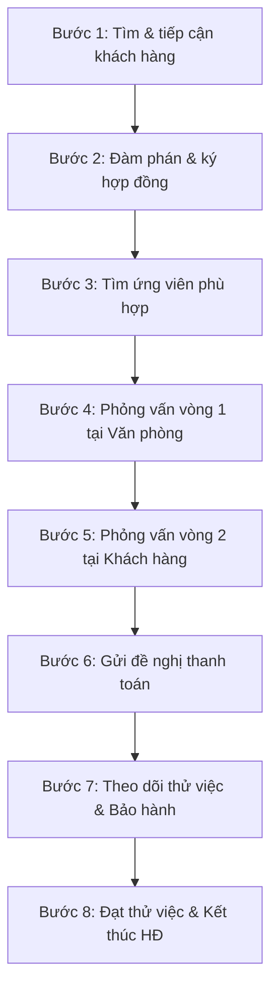

# QUY TRÌNH LÀM VIỆC CỦA NHÂN VIÊN HR (TƯ VẤN TUYỂN DỤNG)

Tài liệu này tổng hợp toàn bộ quy trình vận hành và nghiệp vụ của **Chuyên viên Tư vấn Tuyển dụng (TVTD)** dựa trên các tài liệu quy trình và hướng dẫn nghiệp vụ nội bộ. Quy trình được phân tách rõ ràng thành các mảng: **Quy trình Kinh doanh & Tuyển dụng**, **Quy trình Xử lý Hồ sơ Ứng viên**, **Quy định Lưu trữ Thông tin**, và **Định hướng Ứng dụng Công nghệ (AI)**.

---

## PHẦN I: QUY TRÌNH TÌM KIẾM KHÁCH HÀNG & ỨNG VIÊN (8 BƯỚC)

Đây là quy trình cốt lõi của Chuyên viên TVTD, kéo dài từ giai đoạn tiếp cận khách hàng doanh nghiệp cho đến khi kết thúc hợp đồng bảo hành ứng viên.



### Bước 1: Tìm kiếm và tiếp cận khách hàng
*   **Đối tượng khách hàng mục tiêu:** Tập trung chủ yếu vào các doanh nghiệp FDI (đặc biệt là doanh nghiệp Nhật Bản), hoặc bất kỳ doanh nghiệp nào có quy mô lớn/đủ tiềm lực tài chính chi trả dịch vụ Headhunt.
*   **Các kênh tìm kiếm:**
    *   *Kênh tuyển dụng trực tuyến:* Careerlink, Jobstreet, Careerbuilder... Tìm doanh nghiệp đang đăng tuyển, đánh giá khả năng cung ứng ứng viên trên thị trường để gửi email/gọi điện mời dịch vụ.
    *   *Kênh thông tin đầu tư:* Vtown.vn, hosocongty.vn, thongtindoanhnghiep.co... Xác định doanh nghiệp FDI mới vào Việt Nam, tìm hiểu lĩnh vực hoạt động của họ để chào dịch vụ.
    *   *Mối quan hệ có điều kiện:* Tiếp cận Ban quản lý KCN, Trưởng phòng Nhân sự các nhà máy để kết nối (hỗ trợ chi trả hoa hồng nếu được Giám đốc duyệt).
*   **Tiếp cận khách hàng:** Gửi email kèm báo giá và profile giới thiệu dịch vụ, kết hợp gọi điện trực tiếp.
    > [!IMPORTANT]
    > **Ràng buộc quan trọng:**
    > * Chuyên viên được phép gửi một số hồ sơ chất lượng cao để "ướm thử" nhằm tăng cơ hội hợp tác.
    > * Tuyệt đối **không phỏng vấn vòng 1** và **không gửi hồ sơ chính thức** (vòng 2) trước khi khách hàng ký hợp đồng dịch vụ.
    > * Chỉ gửi Hợp đồng khi khách hàng đã thực sự thiện chí và đồng ý các điều khoản chính (phí, bảo hành, thanh toán).
    > * Mọi trao đổi bằng điện thoại đều phải được xác nhận lại qua email để làm bằng chứng pháp lý.

### Bước 2: Đàm phán và ký kết hợp đồng
*   **Tư vấn Mô tả công việc (JD):** Nghiên cứu yêu cầu của khách hàng về mức lương, trình độ, chức danh xem có phù hợp với thị trường không để tư vấn điều chỉnh JD tối ưu nhất.
*   **Chính sách phí dịch vụ tiêu chuẩn:**
    *   Phí trọn gói: Bằng **02 tháng lương gộp (gross)** của ứng viên.
    *   Cấu trúc phí: **15%** là Phí tuyển dụng ứng viên; **85%** là Phí hỗ trợ & tư vấn chế độ.
    *   Mọi thỏa thuận giảm phí dưới mức quy định hoặc chiết khấu hoa hồng cho nhân sự của khách hàng bắt buộc phải báo cáo và được sự phê duyệt của Ban Giám đốc.
*   **Thuế VAT:** Phí dịch vụ chưa bao gồm 10% VAT. Đối với doanh nghiệp KCN thuộc diện miễn thuế VAT, chuyên viên phải yêu cầu khách hàng cung cấp bản xác nhận miễn thuế (bản scan hoặc bản cứng có dấu đỏ) để chuyển phòng Kế toán. Chuyên viên chịu trách nhiệm hoàn toàn nếu quên thu thập giấy này.
*   **Quy trình duyệt hợp đồng:**
    ```
    Chuyên viên soạn HĐ cứng -> Admin check -> Trưởng nhóm check -> GĐ duyệt/ký nháy -> Chuyên viên ký nháy -> Gửi email báo cáo GĐ (cc Ban Giám đốc & Admin) -> Trình ký GĐ (trước 1 ngày) -> Hành chính đóng dấu -> Chuyển phát nhanh cho khách hàng -> Admin lưu file.
    ```

### Bước 3: Tìm ứng viên
*   **Kênh tìm kiếm:** Tìm qua các trang tuyển dụng trực tuyến, diễn đàn chuyên môn, mối quan hệ hoặc kho dữ liệu nội bộ.
    > [!WARNING]
    > Công ty quy định **không sử dụng các kênh tuyển dụng có tính phí** vào hoạt động tìm kiếm ứng viên nếu chưa được phê duyệt ngân sách.
*   **Sơ loại:** Đánh giá hồ sơ bản mềm, gọi điện trao đổi sơ bộ để lọc các hồ sơ không đạt yêu cầu. Với vị trí cấp cao, phải tham khảo ý kiến của Ban Giám đốc và Trưởng nhóm trước khi gửi đi.
*   **Quy tắc gọi điện cho ứng viên:** Giới thiệu bản thân và công ty -> Hỏi nhu cầu -> Giới thiệu vị trí (tuyệt đối không nói tên khách hàng cụ thể) -> Mời phỏng vấn vòng 1 -> Yêu cầu gửi email xác nhận kèm CV cập nhật theo form mẫu.

### Bước 4: Phỏng vấn vòng 1
*   **Hình thức:** Ưu tiên mời ứng viên phỏng vấn trực tiếp tại văn phòng.
    *   *Trường hợp bất khả kháng (ở tỉnh xa):* Phỏng vấn qua điện thoại và video call (phải đánh giá kỹ ngoại hình, giọng nói, phản xạ và đối chiếu hồ sơ).
    *   *Ứng viên cấp quản lý:* Chuyên viên có thể chủ động hẹn gặp ở địa điểm gần nơi làm việc của họ.
*   **Thời gian:** Hẹn trước ít nhất 01 ngày. Phỏng vấn tối thiểu 30 phút/người. Khung giờ phỏng vấn từ 9h đến trước 17h (tránh sáng sớm, giờ nghỉ trưa hoặc cuối chiều muộn).
*   **Bảo mật thông tin:**
    *   Đề nghị ứng viên **không cung cấp số điện thoại/email cá nhân** cho khách hàng tại vòng phỏng vấn 2.
    *   Sử dụng mã số hồ sơ cho các trường hợp đặc biệt cần bảo mật thông tin.
    *   Khi gửi hồ sơ sang khách hàng: **Xóa bỏ SĐT, email, địa chỉ, ngày sinh (chỉ giữ lại năm sinh)**, dùng form mẫu quy định của công ty và lưu dưới định dạng PDF.
*   **Đánh giá:** Điền kết quả vào form Đánh giá ứng viên. Gửi hồ sơ kèm đánh giá cho khách hàng, gọi điện thúc giục nhận xét sớm để chốt lịch vòng 2.

### Bước 5: Phỏng vấn vòng 2
*   Theo dõi phản hồi từ khách hàng trong tối đa **02 ngày làm việc** (kiểm tra trùng lặp data hồ sơ, đồng ý hay từ chối phỏng vấn vòng 2).
*   Chuyên viên TVTD chốt lịch hẹn phỏng vấn vòng 2 với ứng viên.
*   Sau phỏng vấn vòng 2: Gọi điện cho ứng viên và khách hàng ngay để khảo sát kết quả.
    *   *Nếu không đạt:* Khảo sát chi tiết lý do và thuyết phục/tư vấn thêm nếu có thể.
    *   *Nếu đạt:* Xác nhận ngày nhận việc, mức lương và điều kiện thử việc. Khách hàng và ứng viên ký Hợp đồng lao động thử việc.

### Bước 6: Gửi thanh toán
*   Sau **03 đến 07 ngày** ứng viên đi làm thử việc, chuyên viên TVTD gửi:
    1.  Biên bản xác nhận khối lượng hoàn thành công việc (ngày tháng để trống để khách hàng điền).
    2.  Giấy báo nợ.
*   Khách hàng có nghĩa vụ thanh toán **100% giá trị hợp đồng trong vòng 01 tuần** kể từ ngày ứng viên bắt đầu thử việc.
*   Phối hợp với Kế toán để theo dõi công nợ và xuất hóa đơn VAT.

### Bước 7: Cập nhật - Bảo hành
*   Trong **60 ngày thử việc** của ứng viên: Mỗi tuần chuyên viên phải gọi điện cho khách hàng để cập nhật trạng thái làm việc của ứng viên.
*   **Chính sách bảo hành:**
    *   Nếu ứng viên nghỉ việc hoặc không đạt yêu cầu: Công ty có trách nhiệm tìm kiếm **01 ứng viên khác thay thế miễn phí**.
    *   Nếu trong vòng **30 ngày** kể từ khi ứng viên cũ nghỉ việc, công ty không tìm được người thay thế hoặc khách hàng không muốn tuyển nữa: **Hoàn lại 50% phí tuyển dụng** cho khách hàng.
    *   *Trường hợp loại trừ bảo hành:* Khách hàng tự ý thay đổi mức lương thỏa thuận ban đầu mà không có sự đồng ý của ứng viên dẫn đến việc ứng viên nghỉ việc.
*   **Quy trình hoàn phí:** Lập Biên bản nghiệm thu và giảm giá dịch vụ -> Chuyển Kế toán hủy hóa đơn VAT cũ, xuất hóa đơn mới và chuyển khoản hoàn tiền.

### Bước 8: Kết thúc hợp đồng
*   Xác nhận ứng viên đạt thử việc và ký HĐ chính thức qua email.
*   Gửi thư cảm ơn khách hàng, lưu hồ sơ tài liệu và duy trì liên lạc định kỳ để khai thác nhu cầu mới.

---

## PHẦN II: QUY TRÌNH CHI TIẾT XỬ LÝ HỒ SƠ ỨNG VIÊN (8 BƯỚC KỸ THUẬT)

Đây là quy trình tác nghiệp hàng ngày của nhân viên HR/Headhunter khi tiếp nhận hồ sơ từ các nguồn về hệ thống:

```
[B1: Tiếp nhận] ➔ [B2: Check nhanh & Gửi JD] ➔ [B3: Check kỹ CV] ➔ [B4: Liên hệ ứng viên]
                                                                        │
[B8: Cập nhật Excel] ⮘ [B7: Gửi Headhunt Care] ⮘ [B6: Sửa CV mẫu] ⮘ [B5: Check tiếng]
```

1.  **Bước 1: Tiếp nhận CV:**
    *   Gmail là kênh tiếp nhận chính thống (đánh dấu OK).
    *   Nếu nhận CV qua mạng xã hội (Facebook, Zalo...): Phải trao đổi để ứng viên gửi lại qua Gmail.
2.  **Bước 2: Check nhanh CV và gửi trước JD phù hợp:**
    *   Quét nhanh: Bằng cấp, chứng chỉ ngoại ngữ, kinh nghiệm sơ bộ.
    *   Lọc nhanh các JD trống phù hợp gửi trước để thu hút sự quan tâm của ứng viên.
3.  **Bước 3: Check kỹ CV để chuẩn bị liên hệ:**
    *   *Ảnh:* Phải có ảnh lịch sự. Nếu thiếu, hướng dẫn ứng viên mặc sơ mi đứng vào tường trống nhờ chụp bằng điện thoại.
    *   *Năm sinh:* Chuyển đổi năm sinh từ năm Nhật (nếu có) sang Dương lịch tránh nhầm lẫn.
    *   *Học vấn:* Kiểm tra kỹ hệ đào tạo (Cao đẳng/Đại học/Senmon), tên trường và chuyên ngành. Đối chiếu thời gian học (tránh trường hợp ghi tốt nghiệp ĐH nhưng thời gian học chỉ có 3 năm).
    *   *Ngoại ngữ:* Kiểm tra chứng chỉ (N mấy, thi khi nào). Đánh giá logic (ví dụ: có N3 từ năm 2017 mà chưa lên N2 thì phản xạ có thể tốt nhưng ngữ pháp/kanji yếu).
    *   *Kinh nghiệm:* Kiểm tra các khoảng thời gian trống (gap year), lý do nghỉ việc, thời gian làm việc tại mỗi công ty có quá ngắn không.
4.  **Bước 4: Liên hệ ứng viên:**
    *   Gọi điện làm rõ các thông tin nghi vấn ở Bước 3.
    *   Tư vấn sửa CV nếu cần, trao đổi nguyện vọng cụ thể và giới thiệu job.
    *   Chuyển máy cho **Thực tập sinh (TTS) ngoại ngữ** của văn phòng để check khả năng ngoại ngữ trực tiếp.
5.  **Bước 5: Check tiếng:**
    *   TTS gọi điện check tiếng, đánh giá các tiêu chí: Phản xạ giao tiếp, ngữ pháp, từ vựng, phát âm, thái độ trao đổi.
    *   Chuyên viên lưu file vào máy, đổi tên file theo định dạng: `CV - Họ tên - Năm sinh - Bằng cấp - Ngoại ngữ - Vị trí - Địa chỉ` (Ví dụ: `CV - Nguyen Van A - 1992 - DH - N2 - QLSX - HY`).
    *   Trao đổi với TTS để chốt năng lực thực tế của ứng viên và hướng nghiệp job phù hợp nhất. Gọi điện lại tư vấn kỹ hơn cho ứng viên.
6.  **Bước 6: Chỉnh sửa nội dung CV:**
    *   Chuyển thông tin CV sang mẫu chuẩn của công ty (có thể nhờ TTS ngoại ngữ hỗ trợ dịch thuật và kiểm tra lỗi chính tả).
    *   Xuất file dưới dạng **PDF** trước khi chuyển tiếp.
7.  **Bước 7: Gửi CV sang Headhunt Care của khách hàng:**
    *   Đổi tên file chuẩn hóa: `CV - Họ tên - Năm sinh - Bằng cấp - Ngoại ngữ - Vị trí - Nơi làm việc`.
    *   *Khu vực HCM:* Gửi file đính kèm trực tiếp.
    *   *Khu vực Hà Nội:* Upload CV lên server chung của công ty, sau đó copy link server đính kèm vào email gửi đi.
8.  **Bước 8: Cập nhật thông tin vào file theo dõi:**
    *   Ghi nhận dữ liệu ứng viên vào file Excel quản lý tổng của bộ phận.

---

## PHẦN III: QUY ĐỊNH LƯU TRỮ VÀ QUẢN LÝ THÔNG TIN ỨNG VIÊN

Việc lưu trữ thông tin đầy đủ giúp HR tăng tốc độ khớp lệnh (match job) và duy trì nguồn lực ứng viên bền vững.

### 1. Các trường thông tin bắt buộc phải lưu trữ trên Excel
*   **Thông tin cá nhân:** Họ và tên, Tên gọi, Giới tính, Ngày sinh, Quê quán, Địa chỉ hiện tại, SĐT, Email, Link Facebook, Skype, Linkedin.
*   **Trình độ học vấn:** Bằng cấp (ĐH/CĐ/Senmon), Tên trường, Chuyên ngành, Năm tốt nghiệp, Chứng chỉ ngoại ngữ (N1/N2/N3...), Kết quả check tiếng của TTS, Ngoại ngữ khác.
*   **Nguyện vọng ứng viên:** Địa điểm làm việc mong muốn, Vị trí công việc (Phiên dịch, HCNS, Trợ lý, XNK-Mua hàng, QA/QC, Sản xuất...), Cấp bậc mong muốn (Staff, Supervisor, Manager...), Mức lương mong muốn (VNĐ).
*   **Kinh nghiệm làm việc:** Phân loại cấp bậc kinh nghiệm (TTS mới về nước, DHS mới về nước, Nhân viên có kinh nghiệm, Quản lý...) và số năm kinh nghiệm thực tế.
*   **Trạng thái & Lịch sử tư vấn:** Danh sách job đã tư vấn, Trạng thái hiện tại (Đang tìm việc, Đã trúng tuyển, Đang ở Nhật chờ ngày về nước, Chưa tốt nghiệp...), và các nhận xét đánh giá khác.

### 2. Phương thức lưu trữ
*   **Offline:**
    *   *Sổ tay cá nhân:* Ghi chép nhanh thông tin khi đang gọi điện trực tiếp với ứng viên, sau đó nhập lại vào file.
    *   *File Excel:* Lưu trữ tập trung tại máy tính cá nhân hoặc máy bộ phận. Đặt tên file CV không dấu: `Họ tên – Năm sinh – Trình độ tiếng – Vị trí – Địa điểm` (Ví dụ: `Nguyen Van A – 1990 – N2 – Phien dich – HN`).
*   **Online:** Lưu trữ trên các dịch vụ đám mây chung (Google Drive, Dropbox...) và chia sẻ nhanh thông tin qua Zalo nhóm.

---

## PHẦN IV: QUY TRÌNH BÀN GIAO KHI NGHỈ VIỆC
Để bảo vệ tài nguyên dữ liệu của công ty, khi dừng công việc tại công ty, chuyên viên TVTD tuyệt đối không được tự ý chuyển trực tiếp data khách hàng/ứng viên cho chuyên viên khác. Quy trình bàn giao bắt buộc như sau:

1.  **Bước 1:** Chuyên viên tổng hợp toàn bộ tình trạng các khách hàng đang phụ trách quản lý và danh sách ứng viên đang trong quá trình phỏng vấn/chờ kết quả vào **01 file Word duy nhất**.
2.  **Bước 2:** Gửi email bàn giao chính thức đính kèm file trên tới **Admin**, đồng gửi (Cc) cho **Giám đốc**.
3.  **Bước 3:** Admin phối hợp cùng Giám đốc xem xét, đánh giá khối lượng công việc và tiến hành phân chia cụ thể các tài khoản khách hàng, ứng viên này cho các chuyên viên TVTD khác tiếp tục chăm sóc.

---

## PHẦN V: ĐỊNH HƯỚNG TÍCH HỢP AI VÀO QUY TRÌNH NHÂN SỰ
Công ty đang hướng tới việc đào tạo và ứng dụng công nghệ Trí tuệ nhân tạo (AI) để tối ưu hóa năng suất của chuyên viên TVTD:

*   **Mục tiêu:** Rút ngắn thời gian tuyển dụng (giảm KPI thời gian xử lý), nâng cao độ chính xác khi lọc CV và cải thiện trải nghiệm khách hàng/ứng viên.
*   **Các mảng tích hợp chính:**
    1.  *Tìm kiếm và Sơ loại CV:* Sử dụng các công cụ phân tích CV tự động để lọc nhanh ứng viên phù hợp với tiêu chí của JD.
    2.  *Đánh giá năng lực hành vi:* Ứng dụng mô hình phân tích hành vi AI (qua video phỏng vấn hoặc bài test trực tuyến).
    3.  *Tự động hóa tương tác:* Xây dựng kịch bản và cấu hình Chatbot AI để phản hồi thông tin tự động cho ứng viên (về trạng thái hồ sơ, thông tin JD cơ bản).
